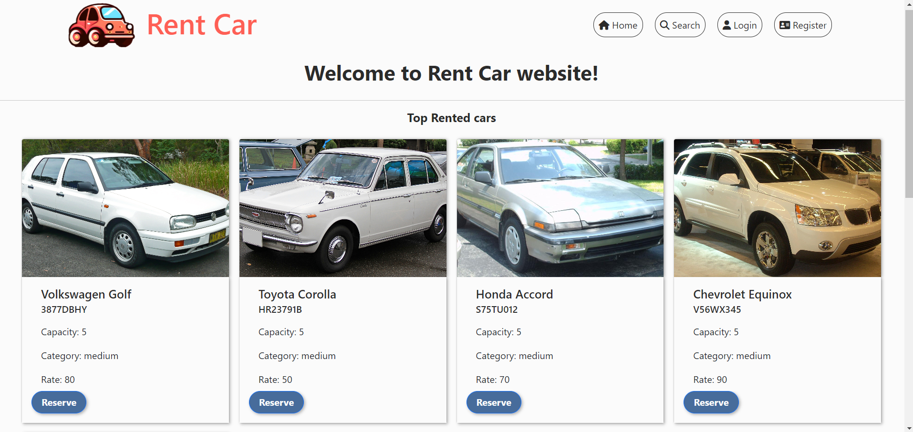
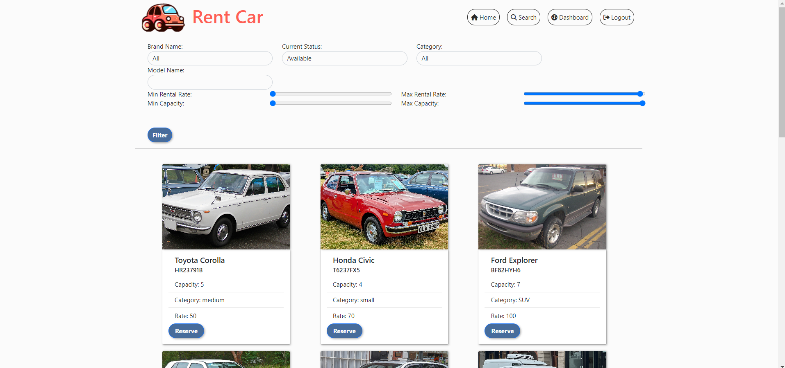
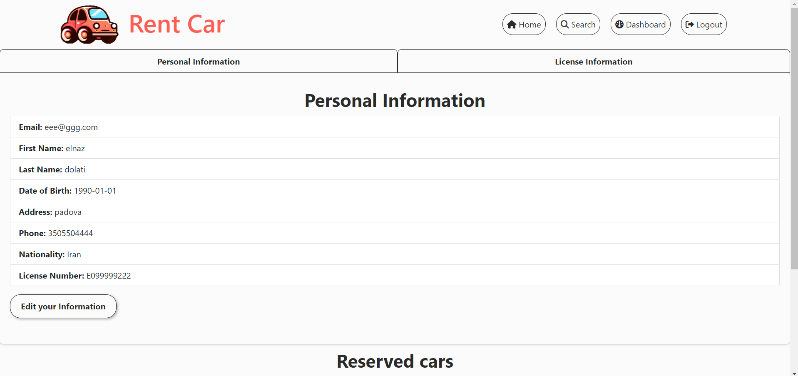
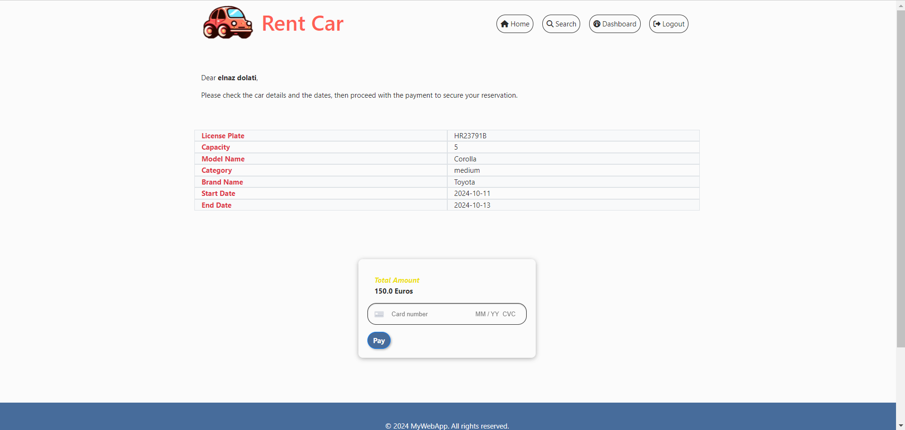

# Java University Project with Stripe Integration


## Table of Contents
- [Project Overview](#project-overview)
- [Features](#features)
- [Technologies Used](#technologies-used)
- [Setup and Installation](#setup-and-installation)
- [Configuration](#configuration)
- [Images from Website](#images-from-website)
- [Contributing](#contributing)
- [Contact](#contact)

## Project Overview

This project is a **Java-based web application** designed as part of a university project. The main functionality includes basic CRUD operations and payment processing via the **Stripe API**. The project follows the **REST API** architecture to allow seamless integration of backend services with external clients. 

The payment system uses **Stripe**, a secure payment processor, to handle transactions, making the project suitable for e-commerce or donation platforms.

## Features

- **RESTful API**: Provides endpoints for various CRUD operations.
- **Stripe Integration**: Process payments using Stripe's secure payment gateway.
- **User Management**: Create, update, retrieve, and delete users.
- **Product Management**: Add, update, retrieve, and delete products.
- **Order Management**: Create and retrieve orders with payment integration.
- **Secure Transactions**: Payments are processed through Stripe with tokens for security.
  
## Technologies Used

- **Java 21+**: Core programming language.
- **Java Servlet**: No frameworks! just pure Java Servlets.
- **Stripe API**: Used for payment processing.
- **Maven**: Dependency management and build automation.
- **Tomcat**: used for local deployment.
- **PostgreSQL**: connected to postgreSQL with Java JDBC for local development and testing.
- **Postman**: For API testing.
- **JSON**: Data format for communication between the server and clients.

## Setup and Installation

### Prerequisites

- **Java 21+** installed
- **Maven** for dependency management
- **Tomcat**: for local deployment.
- A **Stripe account** for payment integration
- IDE like **IntelliJ IDEA** or **Eclipse** for running the project

### Clone the Repository

```
git clone https://github.com/ElnazDt/rentalCar.git
cd rentalCar
```

### Install Dependencies

Run the following command to install all the required dependencies:

```
mvn clean install
```

### build the app and generate HW-1.0.war file

To start the application, use the following command:

```
mvn package
```

deploy the war file on tomcat.

## Configuration

### Stripe API Keys

Before running the project, you need to configure your **Stripe API keys**:
- you need to add your private key in Java\service\StripeConfig.
- you need to add your public key to Java\webapp\jsp\reserve.jsp.

You can obtain these keys from your [Stripe Dashboard](https://dashboard.stripe.com/).

### Database Configuration

you need to make sure that your postgresql database is running and the context file is updated with your database environment. please check Java\META-INF\context.xml

## Images from Website:





## Contributing

Contributions are welcome! Here's how you can contribute:

1. Fork the repository.
2. Create a new branch for your feature or bugfix: `git checkout -b feature-name`.
3. Commit your changes: `git commit -m 'Add new feature'`.
4. Push to the branch: `git push origin feature-name`.
5. Open a pull request.

## Contact

If you have any questions or suggestions about the project, feel free to contact me:

- **Email**: elidolati74@gmail.com
- **GitHub**: [ElnazDt](https://github.com/ElnazDt)
